# Neighborhood Administration System

A web application for managing neighborhood (RT) administration — resident data, house management, monthly fee payments, expenses, and financial reports.

## Tech Stack

| Component | Technology | Version |
|-----------|------------|---------|
| Backend | Laravel (PHP) | 13.x |
| Frontend | React (JavaScript) | 19.x |
| Build Tool | Vite | 8.x |
| Database | MySQL | 8.0 |
| UI Components | shadcn/ui (Radix UI) | latest |
| Styling | Tailwind CSS | 4.x |
| Charts | Recharts | 3.x |
| Icons | Lucide React | latest |
| Authentication | Laravel Sanctum | 4.x |
| Backend Testing | Pest PHP | 4.x |
| Frontend Testing | Vitest + Testing Library | 4.x |

## Features

### Authentication
- Secure login with Laravel Sanctum (session-based SPA authentication)
- All API routes protected behind `auth:sanctum` middleware
- Session-based cookie authentication (no tokens)

### Resident Management
- CRUD resident data (full name, phone number, resident status, marital status)
- Upload and manage ID photos (KTP)
- Resident status: **Permanent** or **Contract**
- Real-time search by name
- Column filters (status, marital status, house assignment)

### House Management
- CRUD house data (house number, address)
- Assign / remove residents to/from houses
- Occupancy status: **Occupied** or **Vacant**
- Full resident history per house (who lived there and when)
- Payment history per house

### Payment Management
- Record monthly fee payments:
  - **Security fee**: IDR 100,000/month
  - **Cleaning fee**: IDR 15,000/month
- Single payment or bulk payment (multiple months at once)
- Auto-generate monthly bills for all active residents
- Mark payments as paid/unpaid
- Filter by year, month, fee type, status

### Expense Management
- Record neighborhood expenses (security guard salary, electricity, repairs, etc.)
- Recurring vs one-time expense tracking
- Filter by year, month, category

### Financial Reports
- Yearly summary with income vs expenses bar chart
- Monthly detail breakdown (income items + expense items)
- Balance calculation per month
- Year selector for historical data

### Dark Mode
- Full dark/light theme toggle
- Persisted in localStorage

## Screenshots

### Login Page
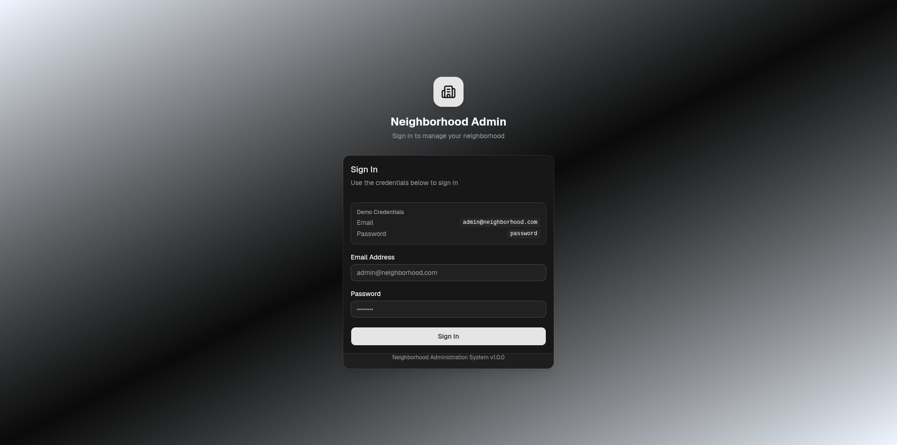

### Dashboard
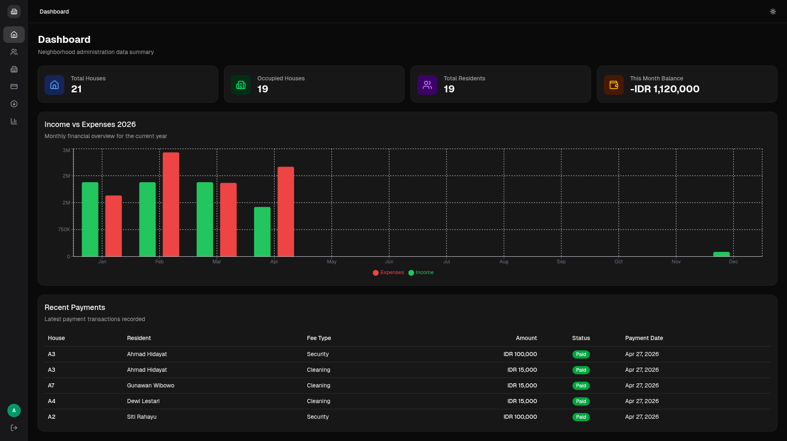

### Resident List
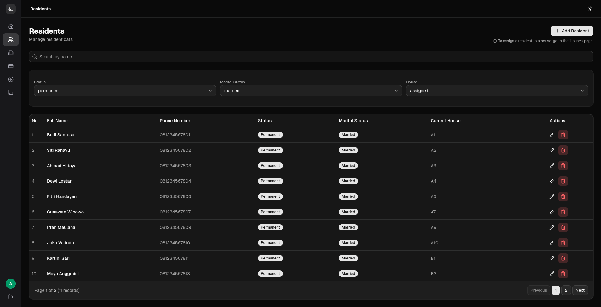

### Resident Form (Add/Edit)
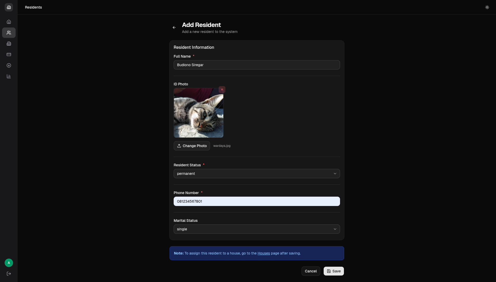

### House List
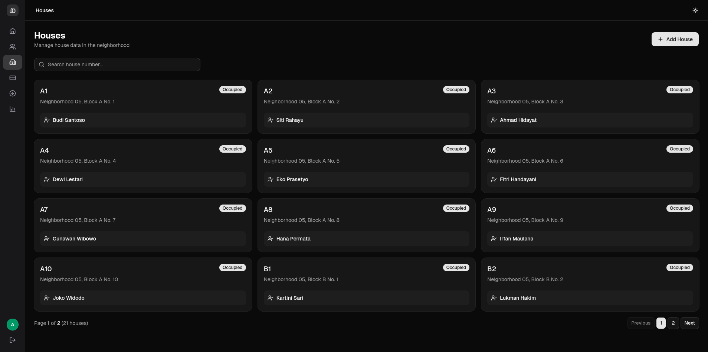

### House Detail (Resident History + Payment History)
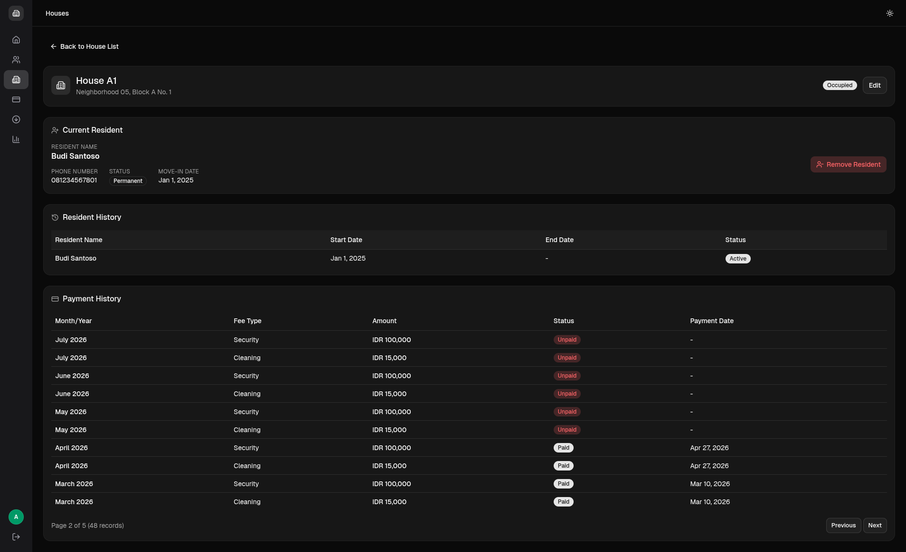

### Payment List
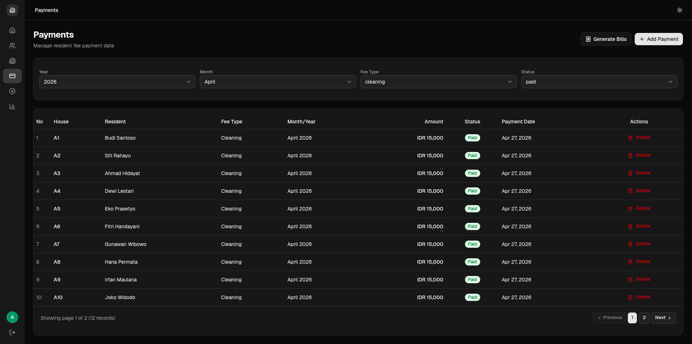

### Payment Form (Single + Bulk)
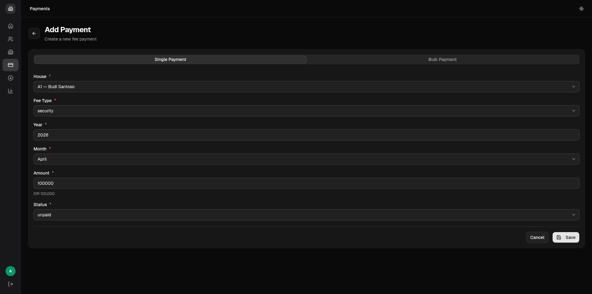

### Generate Bills
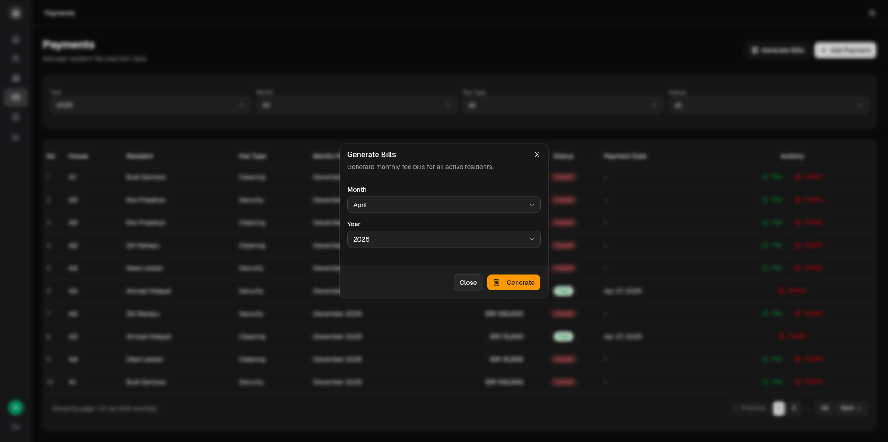

### Expense List
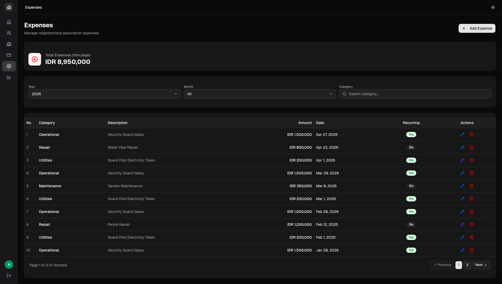

### Expense Form (Add/Edit)
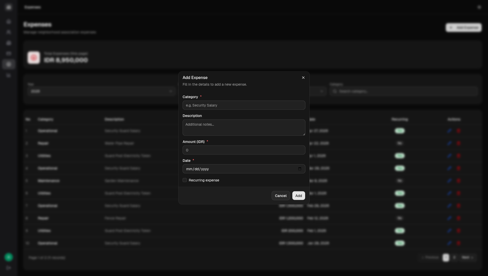

### Financial Report (Chart + Monthly Detail)
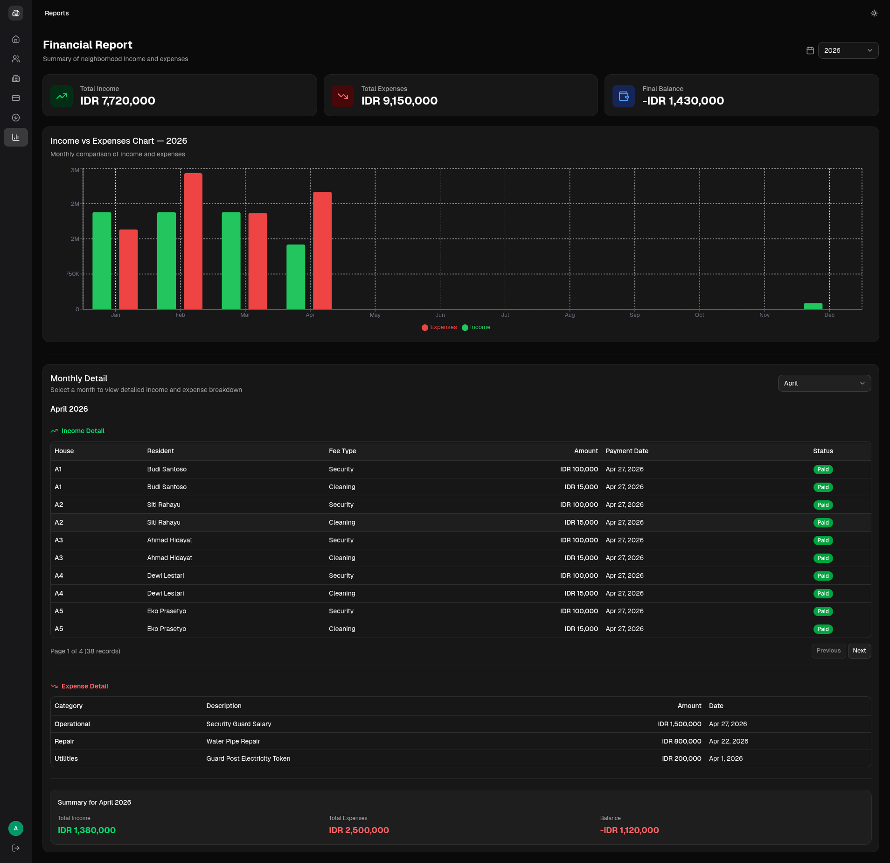

### Light Mode
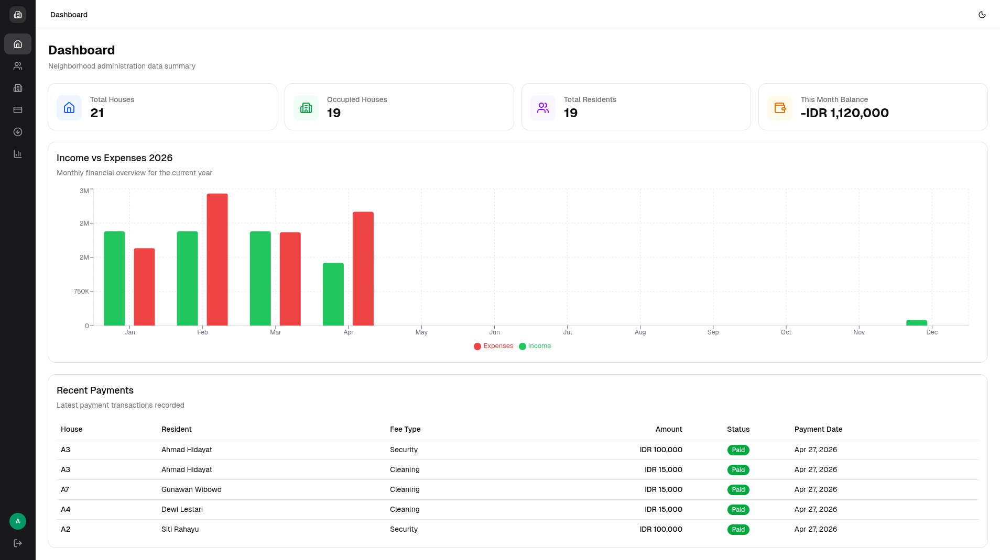

---

## Default Login Credentials

| Field | Value |
|-------|-------|
| Email | `admin@neighborhood.com` |
| Password | `password` |

## Project Structure

```
neighborhood-association-app/
├── backend/                    # Laravel REST API
│   ├── app/
│   │   ├── Http/Controllers/Api/
│   │   │   ├── AuthController.php
│   │   │   ├── ResidentController.php
│   │   │   ├── HouseController.php
│   │   │   ├── PaymentController.php
│   │   │   ├── ExpenseController.php
│   │   │   └── ReportController.php
│   │   └── Models/
│   │       ├── User.php
│   │       ├── Resident.php
│   │       ├── House.php
│   │       ├── HouseResident.php
│   │       ├── Payment.php
│   │       └── Expense.php
│   ├── database/
│   │   ├── migrations/
│   │   └── seeders/
│   │       └── DatabaseSeeder.php
│   ├── routes/
│   │   └── api.php
│   └── tests/
│       └── Feature/            # Pest PHP tests
├── frontend/                   # React + Vite SPA
│   ├── src/
│   │   ├── components/
│   │   │   ├── ui/             # shadcn/ui components
│   │   │   └── Layout.jsx
│   │   ├── contexts/
│   │   │   ├── AuthContext.jsx
│   │   │   └── ThemeContext.jsx
│   │   ├── lib/
│   │   │   └── api.js
│   │   ├── pages/
│   │   │   ├── Login.jsx
│   │   │   ├── Dashboard.jsx
│   │   │   ├── ResidentList.jsx
│   │   │   ├── ResidentForm.jsx
│   │   │   ├── HouseList.jsx
│   │   │   ├── HouseDetail.jsx
│   │   │   ├── HouseForm.jsx
│   │   │   ├── PaymentList.jsx
│   │   │   ├── PaymentForm.jsx
│   │   │   ├── ExpenseList.jsx
│   │   │   ├── Report.jsx
│   │   │   └── NotFound.jsx
│   │   └── test/               # Vitest tests
│   └── vitest.config.js
├── ERD.md                      # Entity Relationship Diagram
└── README.md                   # This file
```

---

## Installation Guide

> **Important:** This guide must be followed step by step. Skipping any step may cause the application to fail.

### Prerequisites

Make sure the following are installed on your computer:

- **PHP** >= 8.2 with extensions: `pdo_mysql`, `mbstring`, `openssl`, `tokenizer`, `xml`, `ctype`, `json`, `bcmath`, `fileinfo`
- **Composer** >= 2.x
- **Node.js** >= 18.x
- **npm** >= 9.x
- **MySQL** >= 8.0

### Step 1: Clone Repository

```bash
git clone <repository-url> neighborhood-association-app
cd neighborhood-association-app
```

### Step 2: Create MySQL Database

Open your MySQL client and create a new database:

```sql
CREATE DATABASE neighborhood_admin;
```

### Step 3: Setup Backend (Laravel)

```bash
# Navigate to backend directory
cd backend

# Install PHP dependencies
composer install

# Copy environment file
cp .env.example .env

# Generate application key
php artisan key:generate
```

Edit the `.env` file and set your database credentials:

```env
DB_CONNECTION=mysql
DB_HOST=127.0.0.1
DB_PORT=3306
DB_DATABASE=neighborhood_admin
DB_USERNAME=root
DB_PASSWORD=your_password
```

Run database migrations and seed initial data:

```bash
# Run migrations (creates all tables)
php artisan migrate

# Seed the database with sample data
php artisan db:seed

# Create storage symlink (required for ID photo uploads)
php artisan storage:link
```

After seeding, the terminal will display:

```
╔═══════════════════════════════════════════════════╗
║  Neighborhood Admin Seeder Complete!              ║
╠═══════════════════════════════════════════════════╣
║  Houses         : 20                              ║
║  Residents      : 18  (15 permanent, 3 contract)  ║
║  Assignments    : 18                              ║
║  Payments       : 834 (534 paid, 300 unpaid)      ║
║  Expenses       : 39                              ║
╠═══════════════════════════════════════════════════╣
║  Admin Login:                                     ║
║    Email    : admin@neighborhood.com              ║
║    Password : password                            ║
╚═══════════════════════════════════════════════════╝
```

Start the backend server:

```bash
php artisan serve --port=8000
```

> Backend will run at `http://localhost:8000`

### Step 4: Setup Frontend (React)

Open a **new terminal** (keep the backend running):

```bash
# Navigate to frontend directory (from project root)
cd frontend

# Install JavaScript dependencies
npm install
```

Start the frontend development server:

```bash
npm run dev
```

> Frontend will run at `http://localhost:3000`

### Step 5: Access the Application

1. Open your browser and go to: **http://localhost:3000**
2. You will see the login page
3. Enter the credentials:
   - **Email:** `admin@neighborhood.com`
   - **Password:** `password`
4. Click **Sign In** to access the dashboard

---

## Seed Data

After running `php artisan db:seed`, the database is populated with realistic sample data:

| Data | Count | Description |
|------|-------|-------------|
| Admin User | 1 | Login account for the application |
| Houses | 20 | A1–A10, B1–B10 |
| Permanent Residents | 15 | Occupying houses A1–A10, B1–B5 |
| Contract Residents | 3 | Occupying houses B6–B8 |
| Vacant Houses | 2 | B9, B10 (no resident assigned) |
| Payments | 834 | Current year + previous year data |
| Expenses | 39 | Security salary, electricity, repairs |

> The seeder generates data relative to the current date, so charts and reports always show relevant data.

---

## API Endpoints

### Authentication
| Method | Endpoint | Description | Auth |
|--------|----------|-------------|------|
| POST | `/api/login` | Login (email + password) | No |
| POST | `/api/logout` | Logout (invalidate session) | Yes |
| GET | `/api/user` | Get authenticated user info | Yes |

> All endpoints below require authentication (`auth:sanctum` middleware).

### Residents
| Method | Endpoint | Description |
|--------|----------|-------------|
| GET | `/api/residents` | List all residents (paginated, searchable) |
| POST | `/api/residents` | Create a new resident |
| GET | `/api/residents/{id}` | Get resident details |
| PUT | `/api/residents/{id}` | Update a resident |
| DELETE | `/api/residents/{id}` | Delete a resident |

### Houses
| Method | Endpoint | Description |
|--------|----------|-------------|
| GET | `/api/houses` | List all houses with occupancy status |
| POST | `/api/houses` | Create a new house |
| GET | `/api/houses/{id}` | Get house details + resident & payment history |
| PUT | `/api/houses/{id}` | Update a house |
| POST | `/api/houses/{id}/assign-resident` | Assign a resident to a house |
| POST | `/api/houses/{id}/remove-resident` | Remove current resident from a house |
| GET | `/api/houses/{id}/history` | Get resident history for a house |

### Payments
| Method | Endpoint | Description |
|--------|----------|-------------|
| GET | `/api/payments` | List payments (filter: month, year, fee_type, status) |
| POST | `/api/payments` | Create a single payment |
| POST | `/api/payments-bulk` | Create bulk payments (month range) |
| POST | `/api/payments-generate` | Auto-generate monthly bills for all active residents |
| GET | `/api/payments/{id}` | Get payment details |
| PUT | `/api/payments/{id}` | Update a payment (e.g., mark as paid) |
| DELETE | `/api/payments/{id}` | Delete a payment |

### Expenses
| Method | Endpoint | Description |
|--------|----------|-------------|
| GET | `/api/expenses` | List expenses (filter: month, year, category) |
| POST | `/api/expenses` | Create an expense |
| GET | `/api/expenses/{id}` | Get expense details |
| PUT | `/api/expenses/{id}` | Update an expense |
| DELETE | `/api/expenses/{id}` | Delete an expense |

### Reports
| Method | Endpoint | Description |
|--------|----------|-------------|
| GET | `/api/reports/summary?year=2026` | Yearly summary (12 months, income vs expenses) |
| GET | `/api/reports/detail?month=1&year=2026` | Monthly detail (itemized income + expenses) |

---

## Running Tests

### Backend Tests (Pest PHP)

```bash
cd backend
./vendor/bin/pest
```

**Test coverage:** 96 tests, 469 assertions across 6 test files:
- `AuthTest` — Login, logout, authentication, access control
- `ResidentTest` — CRUD, search, validation
- `HouseTest` — CRUD, assign/remove resident, history, occupancy status
- `PaymentTest` — CRUD, filters, bulk creation, bill generation
- `ExpenseTest` — CRUD, filters, validation
- `ReportTest` — Yearly summary, monthly detail, correct totals

### Frontend Tests (Vitest)

```bash
cd frontend
npm test
```

**Test coverage:** 91 tests across 6 test files:
- `utils.test.js` — `cn()` utility function
- `api.test.js` — API client methods and axios configuration
- `auth-context.test.jsx` — AuthProvider and useAuth hook
- `theme-context.test.jsx` — ThemeProvider and useTheme hook
- `login.test.jsx` — Login page rendering and interactions
- `not-found.test.jsx` — 404 page

---

## ERD

See [ERD.md](./ERD.md) for the complete Entity Relationship Diagram with all tables, columns, types, relationships, and constraints.

---

## Troubleshooting

### Error: SQLSTATE[HY000] [2002] Connection refused
- Make sure MySQL is running
- Check `DB_HOST`, `DB_PORT`, `DB_USERNAME`, `DB_PASSWORD` in `.env`

### Error: The stream or file "storage/logs/laravel.log" could not be opened
```bash
chmod -R 775 storage bootstrap/cache
```

### Frontend cannot connect to API
- Make sure the backend is running on port 8000: `php artisan serve --port=8000`
- Make sure the frontend proxy is configured in `vite.config.js` (already set up by default)

### ID Photo not showing
```bash
cd backend
php artisan storage:link
```

### Login returns 419 (CSRF token mismatch)
- Make sure `SANCTUM_STATEFUL_DOMAINS` in `.env` includes your frontend URL
- Default: `localhost:3000,localhost:3001,127.0.0.1:3000,127.0.0.1:3001`
- Make sure `SESSION_DOMAIN=localhost` is set in `.env`

### Fresh start (reset all data)
```bash
cd backend
php artisan migrate:fresh --seed
```
This drops all tables, re-creates them, and seeds fresh sample data.
